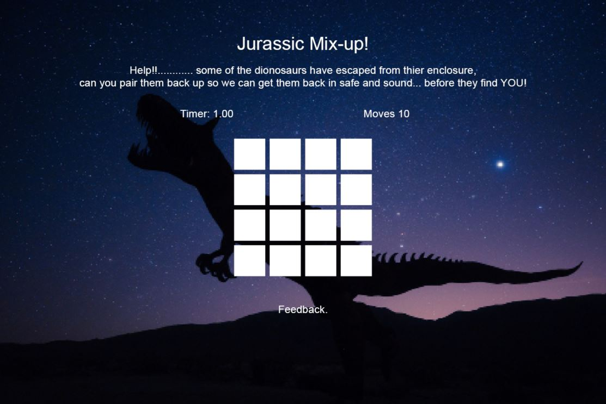

# Jurassic Mix

This project Jurassic Mix is a memory card game, the aim is to match each 2 cards by flipping them over until you have matched them all, all before the timer runs out, then it is game over.

## Showcase

A deployed version of my website can be found [here.] (______________________________)

## navigation

* [UX](#ux)
  + [UX-stories](#ux-stories)
* [Strategy](#strategy)
  + [User-needs](#user-needs)
  + [Business-vision](#business-vision)
* [Scope](#scope)
* [Structure](#structure)
* [Wireframes](#wireframes)
  + [Changes](#changes-to-wireframes)
* [Features](#features)
* [Technologies](#technologies)
* [Testing](#testing)
  + [Testing-plan](#testing-plan)
  + [Implementation](#implementation)
  + [Results](#results)
* [Bugs](#bugs)
* [Deployment](#deployment)
* [Credits](#credits)
* [Content](#content)
* [Media](#media)
* [Acknowledgements](#acknowledgements)

## UX

User stories
## First time visitor goals

* As a first time visitor, my aim is for the user to be engaged by the theme of Dinosaurs and the sound efect used
* As a first time visitor, my aim is for people to clearly understand the rules of the game.
* As a First Time Visitor, I want visitors to enjoy the game and want to try again.

## Returning visitor goals:

* As a returning visitor, my aim is for the site to be familiar and clear for the visitor.
* As a returning visitor, I want my game to be engaging and responsive across all devices.
* As a Returning Visitor, I want my to be fun but challenging with the aspect of the timer.

The end goal of the project is to engage visitors with fun graphics and sounds, also for them to want to return to play.

### UX stories

* As a user I want a fun game for all ages.
* As a user I want to be challenges and be able to play again.
* As a user I want to see exciting graphics and sounds.

## Strategy

### User Needs

As a user the site has to be accessible on mobile, tablet and all browsers. The game should be clear to play, engaging and fun.

### Business vision

The purpose of this project is to give users a fun and engaging game with grat graphics and sound effect, that will want them to return .

## Scope

I want my users to feel they have had a fun experience, which will gurantee their return and tell other about their experience. 

## Structure

This project is a one page website containing a basic heading, a paragraph of the story, instructions followed by the card game, with the option to leave feedback on a contact form. Ending with the footer of social media posts which will open on a seperate tab.

## Wireframes

The original wireframes can be found [here](assets/images/desktop_wireframe.JPG)

The Tablet wireframe can be found [here](assets/images/tablet_wireframe.JPG)

The Mobile wireframe can be found [here](assets/images/mobile_wireframe.JPG)

### Changes to wireframes

My site has changed considerably from the intitial wireframe, as I had my initial idea and as I started to build my page it took me in another direction, the more I descovered new methods.

## Features

This section contains some of the features this project contains:
* My site starts with a 'Click to Start' button' once click, the game will start, the timer will start and the dinosaurs will start roaring.
* The visuals to my site starts with a basic header 'Jurassic Mix'
* Then there is a timer thta begins when the 'Click to Start' button is pressed and the game will begin .
* There is a Flips element also, which tells you how many times you have made a flip.
* below there are 16 individual cards, they are all hidden and all you see is a dinosaur eye which has an animation when hovered over.
* If the user makes a match the game will play a sound effect and the cards will animate and stay visible.
* If the user runs out of time the 'Game Over' sign will appear and they have the option to click to restart the game.
* Alternatively if they find all the matches before the timer, the Victory sign will apear with the option to restart the game and the victory sound affects will play.
* After the game there is a contact form for the user to leave any feedbak or contact us.
* Ending teh page with a simple footer to social media sites which will open in a seperate tab.

## Technologies

This project was build using the following technologies:

### Languages
* HTML5
* CSS3
* JavaScript

### Libraries and online resources:
* Google Chrome Dev Tools: for testing purposes.
* My chosen fonts [Google Fonts}](https://fonts.google.com/).
* W3C HTML-validator: Used to find mistakes in my html code. [HTML-validator](https://validator.w3.org/nu/#textarea)
* FontAwesome: used for icons in the logo. [FontAwesome](https://fontawesome.com/)
* Coolors: to chose a color scheme. [Coolors](https://coolors.co/palettes/trending)
* Responsinator to check my website on all devices. [Responsinator](https://www.responsinator.com/).
* README template from code institute fellow student [README.md template](https://github.com/ThijsTerporten/Climbing-Traveller/blob/master/README.md).
* Design inspiration from [Web Dev Simplified](https://www.youtube.com/watch?v=28VfzEiJgy4)
* All animations and audio Javascript from [PortEXE](https://www.youtube.com/watch?v=3uuQ3g92oPQ)

### Testing

## Testing Plan

I started this project, based on a mobile, as it was qute a simple design layout, I used grids for teh game which is a 4 x 4 grid style, on smaller devices going to a 2 x 8 style.

### Testing User Stories from User Experience (UX) Section

## First Time Visitor Goals

As a First Time Visitor, I want to easily understand the instructions to play the game.

* Upon entering the site, users are automatically greeted with 'Click to start' button.
* The main points are made immediately with the small paragraph telling a short story with instructions to play.
* The user has 100 seconds to complete the game before the timer runs out and the 'Game Over' appears.
* As a First Time Visitor, I want to be engaged and draw into the game, it is easy but the added element of the timer will be more exciting and give an elemnt of a challenge

* The site has been designed to be fluid and easily explained, easy to navigate. .
* At the bottom there is a simple easy to fill out contact or feedback form.
* As a First Time Visitor, I want them to locate our social media links to see our following on social media to determine how trusted and known we are.

## Returning Visitor Goals

As a Returning Visitor, I want the visitor to remeber the rules of the game, be engaged by good graphics and sounds.

As a Returning Visitor, I want them to feel at ease to give honest feedback or developments to improve the game for them.

* They can fill out the form on the page or alternatively they can message the organisation on social media.
* The footer contains links to the organisations Facebook, Twitter and Instagram page.
* Whichever link they click, it will be open up in a new tab to ensure the user can easily get back to the website.
* As a Returning Visitor, I want them to find the Facebook Group link so that they can join and interact with others in the community.
* The Facebook Page can be found at the footer of every page and will open a new tab for the user and more information can be found on the Facebook page.

## Frequent User Goals

As a Frequent User, I want to check to see if there are any newly added elements or levels to the game.

* The user would already be comfortable with the website layout and can easily start the game.
* As a Frequent User, I want them to check to see if there are any new infomation, improvments or new levels added.
* The user would already be comfortable with the website layout and can easily click the links to external social media sites.
* As a Frequent User, I want them to follow us on social media.
* There is a "Submit" button to the bottom of the input field which is located close to the field and can easily be distinguished.

### Further Testing

* The Website was tested on Google Chrome, Internet Explorer, Microsoft Edge and Safari browsers.
* The website was viewed on a variety of devices such as Desktop, Laptop, iPhone7, iPhone 8 & iPhoneX.
* A large amount of testing was done to ensure that the game can be played across all devices.
* Friends and family members were asked to review the site and documentation to point out any bugs and/or user experience issues.

### Implementation

As this is the second website that I created on my own I had very little experience debugging on my own. Testing was mainly done using DevTools in google chrome. 
Starting mobile first then working my way up to bigger screen sizes. 
Whenever an element wasn't located where I wanted it to be I would use the `element.style` box in DevTools to find a solution. 

I used the WC3 code validators to check my code for mistakes as well. 

Testing is done in the following way: 

1. Scroll up and down the page checking for overflow and general positioning of items.
2. In the form, try and click the button to check whether all fields are required to be filled in, check as well whether the e-mail part was set to e-mail.
3. Check all links in the footer whether they react as intended by opening in a new tab (for links section in footer). 
5. Run through all of these steps for each different screen size.
6. Use HTML and CSS validators from W3C schools to find mistakes in code plus JSHint to check the JavaScript.

### Results

Once I had a general idea on how to run testing I followed all steps for each of my pages which gave me the following results for the html:

* stray end tag x 16 times - refering to the </img>
* stray start tag - refering to the <script>

* No errors for the css

* JSHint had 18 warnings

* HTML-validator results: [index.html](assets/images/html_validator_results.JPG)

* CSS-validator results: [style.css](assets/images/css_validator_results.JPG)

* JavaScript-validator results: [script.js](assets/images/js_validator_results.JPG)

### Bugs

#### JavaScript

I found writting my own JavaScript quite complex and time consuming, after more research on w3school and youTube, (youtube found in credits section) I overcome most bugs, functions not working, flip cards, re-arrange carsd at the start of each game.

## Deployment

This project is deployed using gitpod in combination with github pages.
I used gitpod to write all code and seeing it is linked with github it was easy to use the terminal to commit.

### GitHub Pages

## The project was deployed to GitHub Pages using the following steps...

1. Log in to GitHub and locate the GitHub Repository
2. At the top of the Repository (not top of page), locate the "Settings" Button on the menu.
   * Alternatively Click Here for a GIF demonstrating the process starting from Step 2.
3. Scroll down the Settings page until you locate the "GitHub Pages" Section.
4. Under "Source", click the dropdown called "None" and select "Master Branch".
5. The page will automatically refresh.
6. Scroll back down through the page to locate the now published site link in the "GitHub Pages" section.

## Forking the GitHub Repository

By forking the GitHub Repository we make a copy of the original repository on our GitHub account to view and/or make changes without affecting the original repository by using the following steps...

1. Log in to GitHub and locate the GitHub Repository
2. At the top of the Repository (not top of page) just above the "Settings" Button on the menu, locate the "Fork" Button.
3. You should now have a copy of the original repository in your GitHub account.

## Making a Local Clone

1. Log in to GitHub and locate the GitHub Repository
2. Under the repository name, click "Clone or download".
3. To clone the repository using HTTPS, under "Clone with HTTPS", copy the link.
4. Open Git Bash
5. Change the current working directory to the location where you want the cloned directory to be made.
6. Type git clone, and then paste the URL you copied in Step 3.

$ git clone https://github.com/YOUR-USERNAME/YOUR-REPOSITORY

7. Press Enter. Your local clone will be created.

$ git clone https://github.com/YOUR-USERNAME/YOUR-REPOSITORY
> Cloning into `CI-Clone`...
> remote: Counting objects: 10, done.
> remote: Compressing objects: 100% (8/8), done.
> remove: Total 10 (delta 1), reused 10 (delta 1)
> Unpacking objects: 100% (10/10), done.

## Credits 

* Fontawesome for use from their icons. [Fontawesome](https://fontawesome.com/).
* Responsinator to check my website on all devices. [Responsinator](https://www.responsinator.com/).
* Responsive web design columns and grids to help with css columns media query [Responsive Web Design Grid](https://www.w3schools.com/css/css_rwd_intro.asp).
* README template from code institute fellow student [README.md template](https://github.com/ThijsTerporten/Climbing-Traveller/blob/master/README.md).
* Design inspiration from [Web Dev Simplified](https://www.youtube.com/watch?v=28VfzEiJgy4)
* All animations and audio Javascript from [PortEXE](https://www.youtube.com/watch?v=3uuQ3g92oPQ)
* My 5 year old daughter and her love for dinosaurs, she has enjoyed playing this game.

## Content

All content in this project are taken from my 5 year old daughters love for dinosaurs..

## Media 

* All images were taken  [Pixabay](https://pixabay.com/).
* All audio clips were  [Freesound](https://freesound.org/)
* Images were sized using Adobe Photshop
* Wireframes were created using Adobe InDesign

## Acknowledgements 

I would like to acknowledge my mentor Antonio Rodriguez. He reassured me when I was doubtful of myself and my skills, and send me useful information during our mentoring sessions about things he saw I was struggling with. And all the community on Slack, which I relied on heavily for JavaScript help.

**This project was created for educational purposes only, credit for all images goes to their owners**

**Created by Mel Watts**

